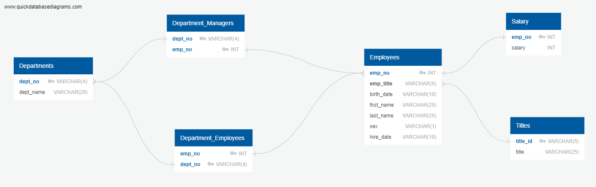

# Employee Database: A Mystery in Two Parts
## Data
This folder contains the raw data for this project in CSV files.

## Diagrams
This folder contains code for generating an Entity Relationship Diagram for this project.
The ERD generated is below:

## Code
This folder contains SQL code to generate the tables and to analyze the data.
It also contains a Jupyter Notebook to further analyze the data beyond what is possible in SQL.
